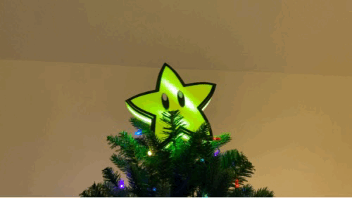
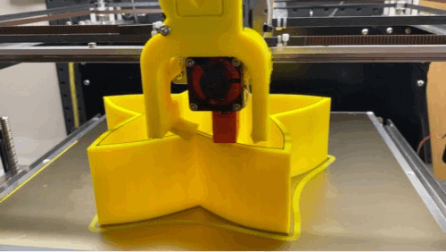

# Arduino-Starman
Light-up Christmas Tree Topper

Found from https://www.reddit.com/r/3Dprinting/comments/k0k0fa/our_first_3d_designed_printed_and_programmed/
A few changes from the original. Added a small raised border to the face cover to enlarge the black border via a filament change added to the slicer settings. Fixed the schematic for the tx/rx pins and hopefully made the button pins clearer. Mine was printed in yellow PLA instead of clear, with 3 top/bottom layers, 3 wall lines ad 20% lines infill.

Here are all files and assets used for my Arduino Starman. Feel free to use and change as you see fit - just tag me (https://github.com/datboiii93/Arduino-Starman) in the finished product so I can learn from your ideas!

Included Assets:
Starman STL files (front, rear, tube)
Arduino .ino file

Parts Used:
Filaments Used: Hatchbox Yellow https://www.amazon.com/HATCHBOX-3D-Filament-Dimensional-Accuracy/dp/B00J0GRREW
	Filament change to black on the shell for the last few layers, and for the start of the eyes on the face (https://www.amazon.com/HATCHBOX-3D-Filament-Dimensional-Accuracy/dp/B00MEZE7XU)
	Filament change on the pupils to white (https://www.amazon.com/HATCHBOX-3D-Filament-Dimensional-Accuracy/dp/B00J0GMMP)

Arduino Nano (by RexQualis) (https://www.amazon.com/gp/product/B07WK4VG58/)
Rope Light WS2812B (https://www.amazon.com/gp/product/B01CDTEJR0/)
DFPlayer Mini MP3 Module with Speaker(https://www.amazon.com/gp/product/B07WNRHH8Z/)
Regular push button (https://www.amazon.com/gp/product/B07Q5LNFG3)
15' Micro USB (https://www.amazon.com/gp/product/B002KL8N6A)
5v / 1A USB-Wall Adapter (Note that the audio would cut out when powered from the PC usb, seemingly from power draw)

